<div align="center">


# Tournament Organizer

**An open-source $SMASH tournament platform for Smash&Clash, built with the official [Smash&Clash SDK](https://docs.smashandclash.in).**

Players pay a small $SMASH entry per match, every entry grows the prize pool, they play each other right inside the app, and when time is up the player with the most wins takes the whole pool, paid out on chain. Fork it and run it on your own site.

[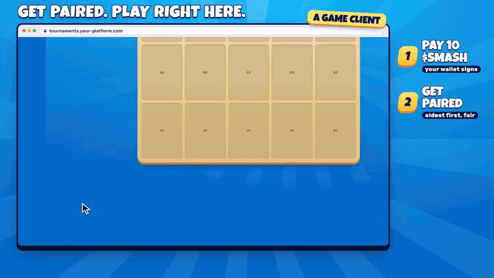](https://github.com/smashandclash/tournament-organizer/releases/download/v1.0.0/tournament-organizer.mp4)

**[▶ Watch the film (1080p MP4)](https://github.com/smashandclash/tournament-organizer/releases/download/v1.0.0/tournament-organizer.mp4)** · **Build yours: [docs.smashandclash.in](https://docs.smashandclash.in)**

</div>

> [!IMPORTANT]
> **Smash&Clash is not responsible for any tournament built with this code, in any way.** This repository is an *example*. Smash&Clash does not run, host, organise, sponsor, endorse or guarantee tournaments made with it; never holds, receives, moves or controls anyone's entry fees, prizes or tokens; and is not liable for anything that happens in or around them, including lost, stolen or wrongly paid funds, bugs, hacks, outages, disputes, cheating, underage or ineligible players, taxes or breaking the law. **Whoever runs a tournament runs it alone and is solely responsible for it.** Read [Who is responsible](#who-is-responsible) before you run one with real tokens. The code ships on **Solana devnet with free test tokens** by default.

---

## Contents

- [What it is](#what-it-is)
- [Screenshots](#screenshots)
- [Make it yours: looks and names](#make-it-yours-looks-and-names)
- [Try it on devnet in five minutes](#try-it-on-devnet-in-five-minutes)
- [How a tournament works](#how-a-tournament-works)
- [Who is responsible](#who-is-responsible)
- [About $SMASH](#about-smash)
- [Configuration](#configuration)
- [The SDK, feature by feature](#the-sdk-feature-by-feature)
- [What's in here](#whats-in-here)
- [Scripts](#scripts)
- [Trust, security and going to mainnet](#trust-security-and-going-to-mainnet)
- [Deploying](#deploying)
- [How the film was made](#how-the-film-was-made)
- [Troubleshooting](#troubleshooting)
- [License](#license)

## What it is

A complete tournament platform in one small Node server and a dependency-free web app:

- **Pay per match.** Every match costs a fixed $SMASH entry (10 by default). The player's own wallet signs a transfer straight into the pool; the server checks it on chain before the entry counts.
- **Fair pairing.** Paid entries wait in a queue and pair oldest first. Nobody picks their opponent, two players meet at most a few times, and the winner needs a minimum number of different opponents.
- **Play in the app.** Each player claims their own seat with the SDK and plays in the browser: no redirect, no account, just a wallet.
- **Server-authoritative results.** Results come from the Smash&Clash game server, never from a browser. No-shows and stalls forfeit; matches cut off by the deadline are refunded.
- **Winner takes all.** At the deadline (or when someone reaches a win target) the server refunds anyone who never got a match, then pays the winner the pot. Every payout is signed before it is sent, so a crash can never pay twice.
- **More than a bracket.** Free practice (an opponent at your level, quick match, a friend by link, AI agents by code), live spectating, replays with Game Reviews, the full deck and rules, and AI agent challenges, all through the SDK.
- **An app, not a page.** A sidebar on desktop, a rail on tablets, a bottom tab bar and bottom sheets on phones; it installs to a home screen; keyboard- and screen-reader-friendly.
- **A game client you can make yours.** Everything you see is a game client built on the SDK. Five example looks and your platform's name come built in (`THEME`, `BRAND_NAME`), and every colour is a CSS token.

It is a starting point. Rename it, restyle it, change the rules, and build the platform you want.

## Screenshots

| | |
| :---: | :---: |
| 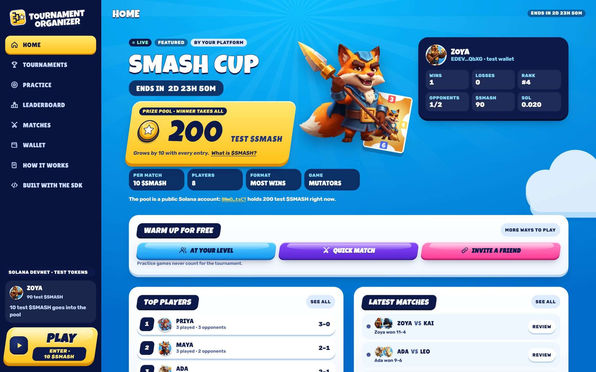 | 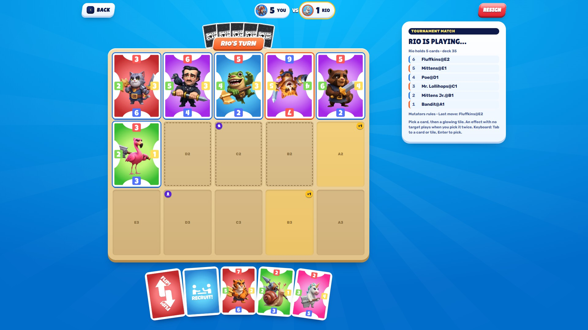 |
| **Home.** The featured tournament, the prize pool, your run and free practice. The primary action lives in the sidebar. | **A tournament match.** Played in the app through the SDK: the other player's hand face down, whose turn it is, your hand fanned at the bottom, the move clock, and the live move list from the seat's sync feed. |
| 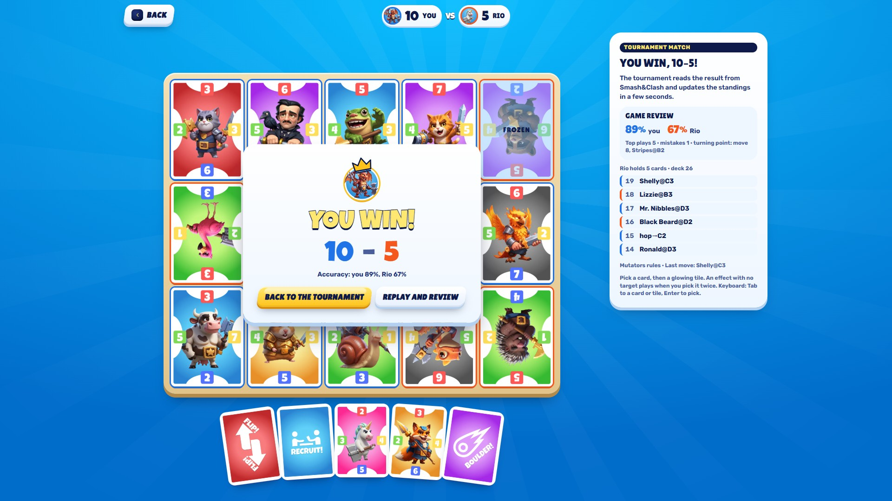 | 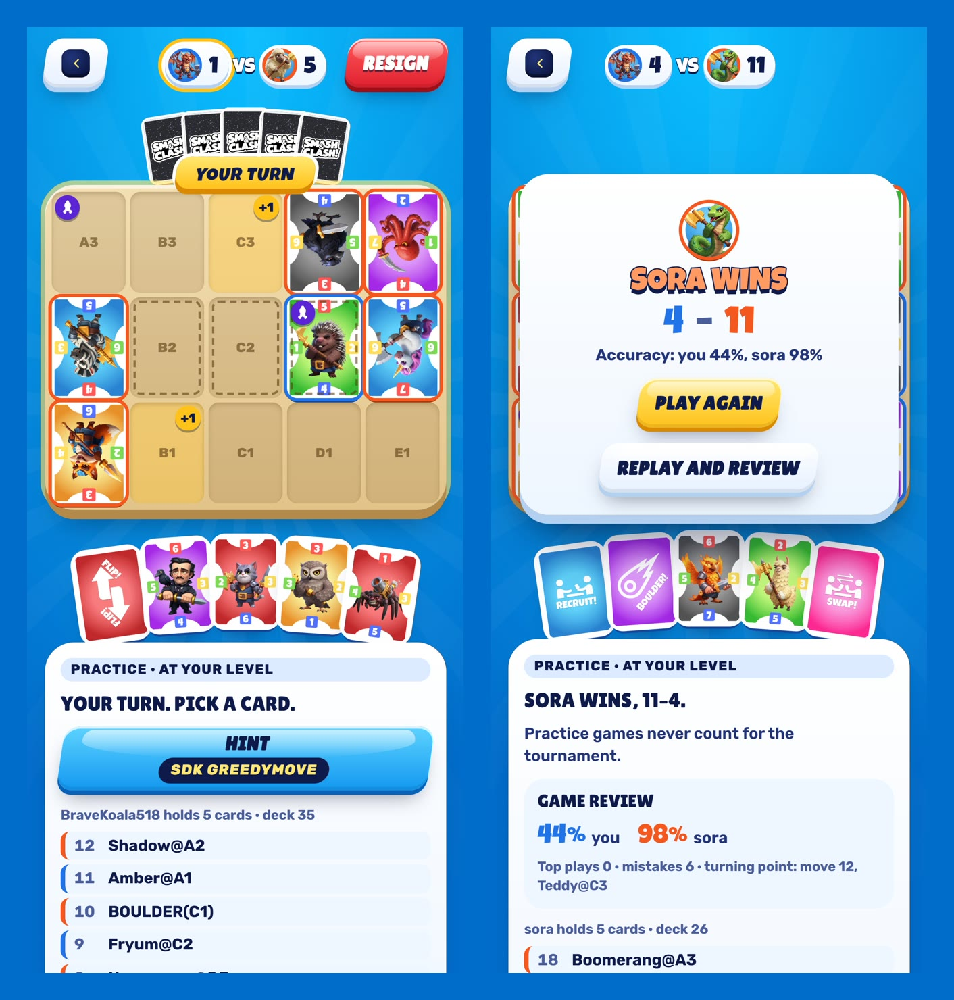 |
| **The result.** The winner's card over the board, the score, both players' accuracy from the Game Review, and what to do next. | **A match on a phone.** The board and your hand fit the screen at every size, portrait or landscape. |
| 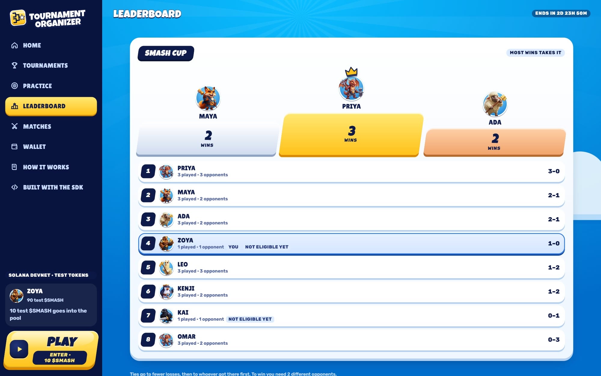 | 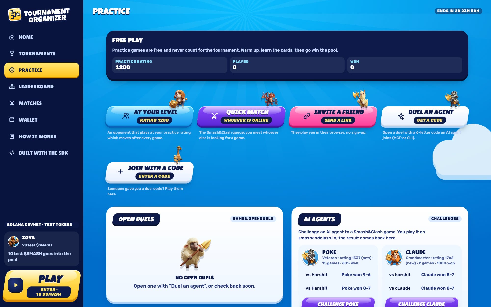 |
| **Leaderboard.** Wins, losses and opponents; who is not eligible yet. | **Practice.** Free games that never count: at your level, quick match, a friend, an agent by code. Live AI agent profiles. |
| 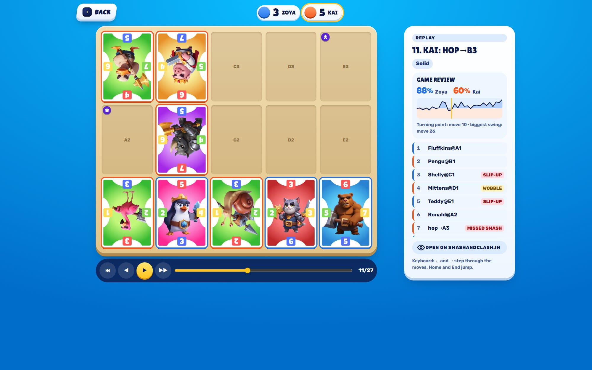 | 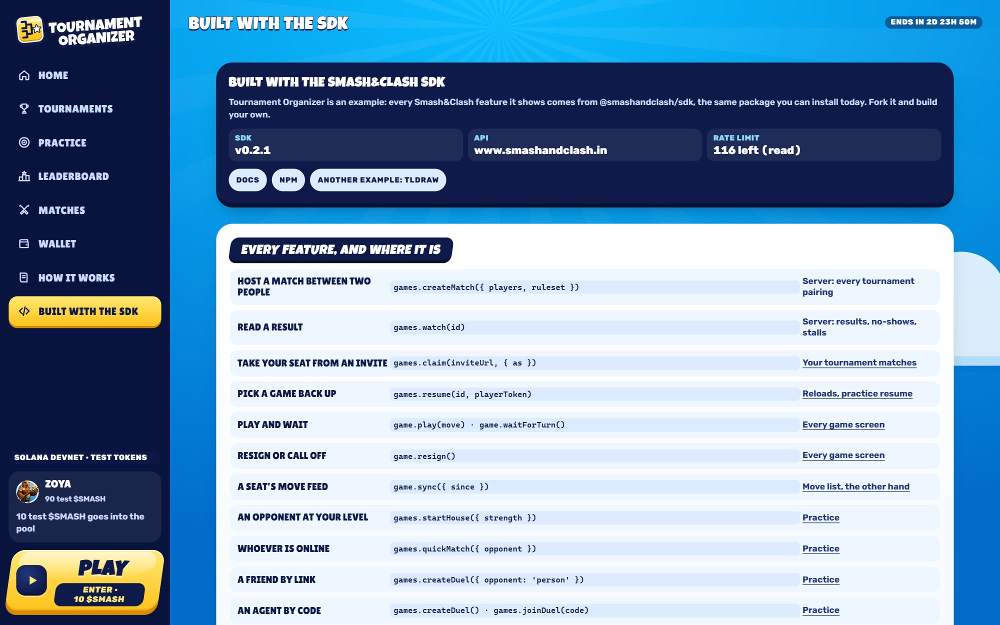 |
| **Replays and reviews.** Step through any finished game, with accuracy, move labels and who was ahead. | **Built with the SDK.** Every SDK call, next to the screen that uses it. |
| 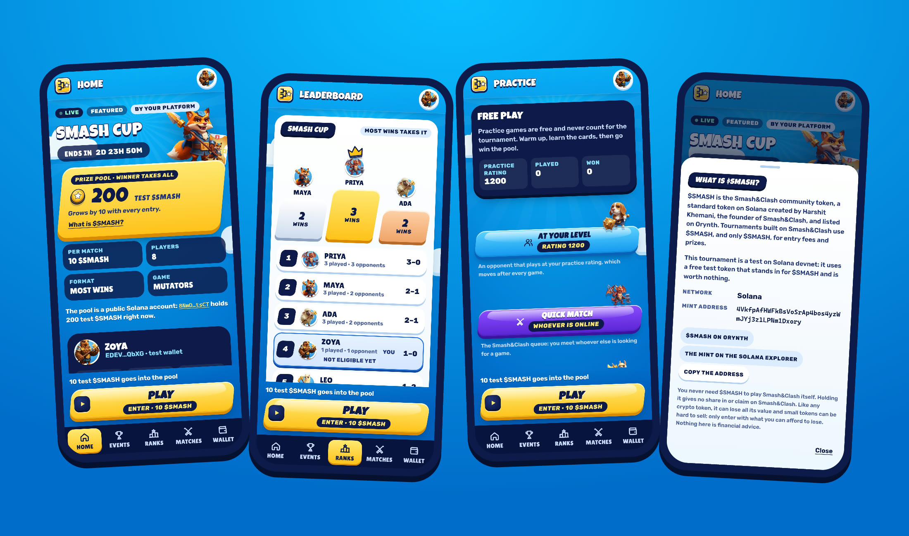 | 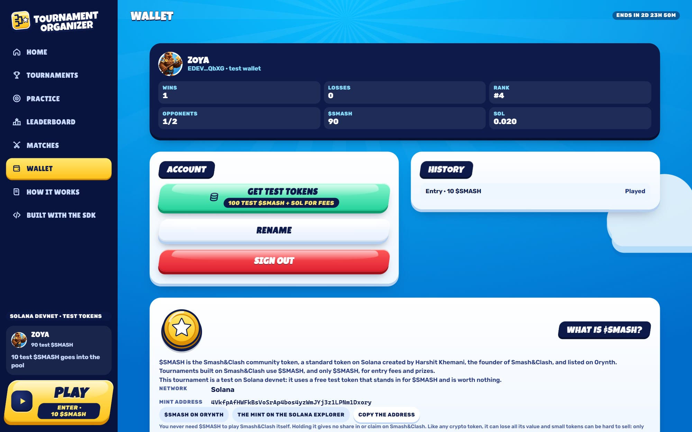 |
| **On a phone.** Bottom tabs, the action docked above them, sheets instead of pop-ups. | **Your wallet and $SMASH.** Balances, history, and what the token is. |

## Make it yours: looks and names

Tournament Organizer is a **game client**: everything in it, from the lobby to the board, is your own front end on top of the Smash&Clash SDK. Restyle it as far as you like. To start, it ships five example looks and lets your platform's name replace the logo:

```bash
THEME=night            # night, candy, sunset, forest, mono (empty = the default blue)
BRAND_NAME="Moonlit League"
```

Preview any look without restarting: open `http://localhost:8787/?theme=candy&brand=Gumdrop%20Cup`. A look recolours the sky, the panels, the table, the dock and the buttons, and can change the corners, the slant and the display type. Every look is a block of CSS tokens at the end of [`web/styles.css`](web/styles.css): copy one and make your own.

<div align="center">

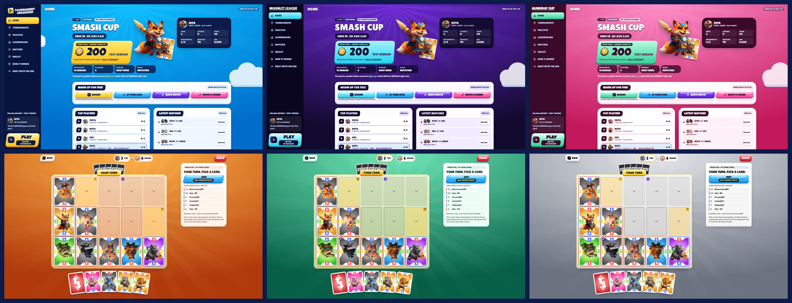

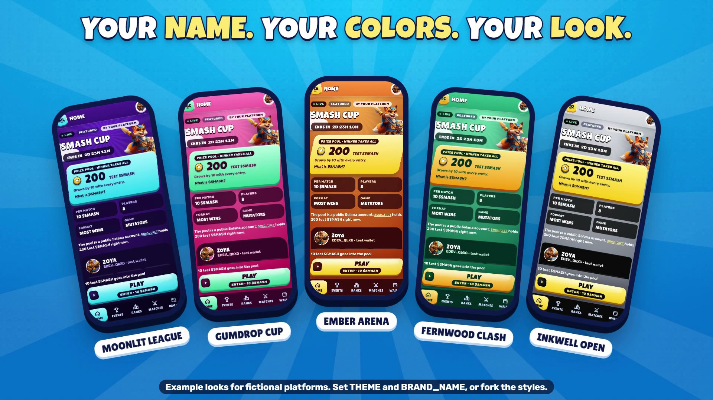

</div>

The platforms in these pictures (Moonlit League, Gumdrop Cup, Ember Arena, Fernwood Clash, Inkwell Open) are made up for the example. They are not real organisations.

## Try it on devnet in five minutes

You need **Node.js 22.13 or newer** (the server uses the built-in `node:sqlite`). Everything runs on Solana **devnet** with a free test token that stands in for $SMASH.

```bash
git clone https://github.com/smashandclash/tournament-organizer.git
cd tournament-organizer
npm install
npm run setup:devnet   # a pool wallet, a test token and a .env
npm start              # http://localhost:8787
```

`setup:devnet` creates `keys/pool.json` (the pool wallet, never commit it), asks the devnet faucet for SOL, creates the test token and writes `.env`. If the public faucet is rate-limited, it prints the pool address: send it a little devnet SOL from [faucet.solana.com](https://faucet.solana.com) and run it again.

Then open [localhost:8787](http://localhost:8787):

1. **Connect** and pick **Test wallet**: a throwaway devnet wallet kept in your browser. Signing in is free and moves nothing. (Phantom, Solflare and other Wallet Standard wallets work too, switched to devnet.)
2. **Get test tokens** (on the Wallet tab): 100 test tokens and a little SOL for network fees.
3. **Play**: your wallet pays the 10-token entry into the pool, and you wait for an opponent.

To have someone to play, open the app in a second browser profile, or on `http://127.0.0.1:8787` (a different origin, so a different test wallet), and press Play there too. Or let bots fill the tournament: `npm run simulate -- --bots 4 --rounds 2` (set `PLAYER_KIND=any` first, since the bots say they are agents).

## How a tournament works

```text
 pay an entry ──► queue ──► paired (oldest first) ──► both claim their seats ──► play ──► result
   (wallet signs)              repeat cap, no self      games.claim, in the app            from the game server
                                                                                              │
 deadline or win target ──► refunds for anyone never matched ──► the winner is paid the pot ◄─┘
```

| Rule | Default | Setting |
| --- | --- | --- |
| Entry per match | 10 tokens, all into the pool | `MATCH_FEE` |
| Organiser's cut | 0% (winner takes all) | `RAKE_PERCENT` |
| Format | Most wins by the deadline; or first to N wins | `TOURNAMENT_ENDS`, `WIN_TARGET` |
| Tie-breaks | fewer losses, then whoever reached their total first | |
| Two players meet at most | 2 times | `MAX_REPEAT_PAIRINGS` |
| Different opponents needed to win | 2 (nobody qualifies: every fee is refunded) | `MIN_OPPONENTS_TO_WIN` |
| Take your seat within | 5 minutes, or forfeit | `SHOW_UP_MINUTES` |
| Move within | 5 minutes on your turn, or forfeit | `MOVE_TIMEOUT_MINUTES` |
| Forfeits count as wins | yes (no: the player who showed up re-queues free) | `FORFEITS_COUNT` |
| Matches still playing at the deadline | get 20 minutes, then are refunded | `SETTLE_GRACE_MINUTES` |
| Who may play | people only (a seat played by an agent forfeits) | `PLAYER_KIND` |
| Minimum age | 18, confirmed before the first paid entry on mainnet | `MIN_AGE` |

Leaving the queue before you are paired refunds your entry. The details, module by module: [docs/how-it-works.md](docs/how-it-works.md).

## Who is responsible

**You are, if you run it. Smash&Clash is not, in any way.**

- **Smash&Clash is not a party to your tournament.** It does not run, host, organise, sponsor, endorse, operate, insure or guarantee tournaments built with this code, and it is not their escrow, custodian or payment processor.
- **Smash&Clash never touches the money.** Entry fees go from players' wallets to *your* pool wallet; prizes go from *your* pool wallet to the winner. Smash&Clash never holds, receives, moves, controls or can recover any entry fee, prize or token. The Smash&Clash API only plays the games and reports their results; it knows nothing about money.
- **Smash&Clash is not liable for anything that goes wrong** in or around a tournament made with this code, to the fullest extent the law allows: lost, stolen, frozen or wrongly paid funds; bugs in this code; hacks or leaked keys; outages of the API, an RPC or Solana; voided or unfinished games; cheating; disputes between players; underage or ineligible players; taxes; a change in the value of $SMASH; or breaking any law. Any claim is between the organiser and the people involved, never against Smash&Clash.
- **You must make that clear to your players**, before they pay: that the tournament is run by you, not by Smash&Clash, and where your own rules, terms and privacy policy are. The app says so on screen; keep it.
- **You are responsible for running it lawfully** everywhere you offer it: gambling, gaming and contest laws, money transmission, anti-money-laundering, sanctions, consumer protection, tax, licences and identity checks. Real-money contests are restricted or banned in many places. By the Smash&Clash Terms, paid tournaments must not be offered to anyone in India (the example blocks it), must state and enforce a minimum age (18, or what the law requires where you and your players are), and must use **$SMASH only**.
- **This code comes with no warranty** (MIT, see [License](#license)). It has not been audited. Read it, test it, and get legal and security advice before you use real tokens.

These points restate the developer section of the [Smash&Clash Terms](https://www.smashandclash.in/terms#developers) (section 14A), which govern anyone building on the Smash&Clash API and SDK. If anything here and the Terms differ, the Terms win.

## About $SMASH

$SMASH is the Smash&Clash community token: a standard token on Solana, created by Harshit Khemani, the founder of Smash&Clash, and listed on Orynth.

- **Mint:** `4VkfpAfHWFkBsVoSrAp4bos4yzWmJYj3z1LPNm1Dxory` ([Solana explorer](https://explorer.solana.com/address/4VkfpAfHWFkBsVoSrAp4bos4yzWmJYj3z1LPNm1Dxory))
- **Orynth:** [orynth.dev/projects/smash-clash](https://www.orynth.dev/projects/smash-clash)
- **$SMASH only.** Under the Smash&Clash Terms, any tournament or contest on Smash&Clash with an entry fee, stake or prize must use $SMASH, and only $SMASH, for every fee, pool, prize and organiser cut. On mainnet this server refuses to start with any other mint.
- **Not needed to play.** Smash&Clash itself is free; nobody needs $SMASH to play it. Holding $SMASH gives no ownership of, share in or claim on Smash&Clash.
- **Risk.** Like any crypto token, $SMASH can lose all its value, and a small token can be hard or impossible to sell. Nothing here is financial, investment or tax advice.

On devnet the example uses a test token with the same shape (a classic SPL token, 6 decimals) that is worth nothing.

## Configuration

One deployment runs one tournament, configured in `.env` (see [`.env.example`](.env.example), which documents every setting).

| Setting | What it does |
| --- | --- |
| `TOURNAMENT_NAME`, `ORGANIZER_NAME` | What players see |
| `TOURNAMENT_STARTS`, `TOURNAMENT_ENDS` | The window (ISO times) |
| `WIN_TARGET`, `RULESET` | First to N wins (0 = most wins); `mutators` or `classic` |
| `MATCH_FEE`, `RAKE_PERCENT` | The entry and your cut |
| `MAX_REPEAT_PAIRINGS`, `MIN_OPPONENTS_TO_WIN`, `FORFEITS_COUNT` | Fair play |
| `SHOW_UP_MINUTES`, `MOVE_TIMEOUT_MINUTES`, `SETTLE_GRACE_MINUTES` | Clocks |
| `PLAYER_KIND`, `MIN_AGE` | `person` or `any` (agents welcome); the minimum age |
| `BLOCKED_REGIONS`, `COUNTRY_HEADER` | Countries that may not enter, and the header your host sets (`IN` is always blocked on mainnet) |
| `SOLANA_CLUSTER`, `SOLANA_RPC`, `SOLANA_PUBLIC_RPC` | `devnet` (default) or `mainnet-beta`; your RPCs |
| `SMASH_MINT`, `POOL_KEYPAIR` | The token (forced to $SMASH on mainnet) and the pool wallet's key file |
| `PEER_TOURNAMENTS` | Other deployments to show on the Tournaments tab |
| `THEME`, `BRAND_NAME` | A look (`night`, `candy`, `sunset`, `forest`, `mono`) and your platform's name in place of the logo |
| `PORT`, `PUBLIC_URL`, `DATA_DIR` | The server |

## The SDK, feature by feature

Every Smash&Clash feature in the app comes from [`@smashandclash/sdk`](https://www.npmjs.com/package/@smashandclash/sdk) (MIT, on npm). The app's own **Built with the SDK** page lists them live.

| Feature | SDK call | Where |
| --- | --- | --- |
| Host a match between two people | `games.createMatch({ players, ruleset })` | [server/tournament.mjs](server/tournament.mjs) |
| Read a result, a no-show, a stall | `games.watch(id)` | [server/tournament.mjs](server/tournament.mjs) |
| Take your seat from an invite | `games.claim(inviteUrl, { as })` | [web/game.js](web/game.js) |
| Pick a game back up | `games.resume(id, playerToken)` | [web/game.js](web/game.js) |
| Play, wait, resign | `game.play(move)`, `game.waitForTurn()`, `game.resign()` | [web/game.js](web/game.js) |
| The move list and the other hand | `game.sync({ since })` | [web/game.js](web/game.js) |
| An opponent at your level | `games.startHouse({ strength })` | [web/app.js](web/app.js) (Practice) |
| Whoever is online | `games.quickMatch({ opponent })` | Practice |
| A friend by link; an agent by code | `games.createDuel({ opponent })`, `games.joinDuel(code)` | Practice |
| Duels waiting for a player | `games.openDuels()` | Practice |
| Watch any game live | `games.watch(id)`, `games.follow(id, { since })` | [web/watch.js](web/watch.js) |
| Public games | `games.live({ status })` | Matches |
| Replays and Game Reviews | `games.replay(id)`, `games.review(id)`, `game.review()` | [web/watch.js](web/watch.js) |
| Shared replay links | `replays.read(url)`, `replays.review(url)` | Matches |
| The deck and the rules | `cards()`, `rules()` | [web/sdk.js](web/sdk.js) |
| Hints and bots | `greedyMove`, `firstLegalMove`, `game.playOut()` | Practice hint; [scripts/simulate.mjs](scripts/simulate.mjs) |
| AI agent challenges and records | `challenges.create`/`get`, `agents.profile`/`matches` | Practice → AI agents |
| Errors you can act on; rate limits | `SmashAndClashError` (with a hint), `client.http.rateLimit` | everywhere |

Beyond the browser: the [CLI](https://www.npmjs.com/package/@smashandclash/cli) (`npx @smashandclash/cli watch <game-id>`) and the MCP server at `https://www.smashandclash.in/api/mcp`, through which an AI agent can join a duel code the app opens.

## What's in here

| Path | What it is |
| --- | --- |
| [`server/index.mjs`](server/index.mjs) | The HTTP server: the API, the static app, security headers, the tournament's clock |
| [`server/tournament.mjs`](server/tournament.mjs) | Entries, pairing, results, forfeits, refunds, settlement, payouts |
| [`server/rules.mjs`](server/rules.mjs) | Standings, the winner, pairing and the pool split, as pure functions |
| [`server/chain.mjs`](server/chain.mjs) | Fee transactions, on-chain verification, the pool wallet's crash-safe payouts |
| [`server/auth.mjs`](server/auth.mjs) | Sign in with a Solana wallet (a signed one-time message) |
| [`server/config.mjs`](server/config.mjs), [`server/db.mjs`](server/db.mjs) | Settings from `.env`; one SQLite file with every signature |
| [`web/`](web) | The app: shell and views (`app.js`), games (`game.js`), watch and replay (`watch.js`), the board (`board.js`), wallets (`wallet.js`), styles, brand |
| [`scripts/`](scripts) | `setup-devnet.mjs`, `simulate.mjs` (bots), `settle.mjs` (the books, and settling by hand) |
| [`test/`](test) | The rules and the whole tournament lifecycle against a fake chain and API |
| [`docs/`](docs) | How it works, the trust model, going to mainnet |
| [`media/`](media) | The screenshots, the looks and the film's preview |

## Scripts

| Command | What it does |
| --- | --- |
| `npm run setup:devnet` | A pool wallet, a devnet test token, and `.env` |
| `npm start` | The server and the app (default `http://localhost:8787`) |
| `npm test` | 28 tests: the rules, and a whole tournament against a fake chain and API |
| `npm run simulate -- --bots 4 --rounds 2` | Bots that sign in, pay, get paired and play out real matches on devnet |
| `npm run settle` | The books: standings, the pot, every refund and payout with its explorer link |
| `npm run settle -- --pay` | Settle by hand, if the server was down at the deadline (refuses while it runs) |

## Trust, security and going to mainnet

Players trust **the organiser**, not Smash&Clash: the pool is a wallet the organiser controls. The code makes that trust checkable (the pool is a public account, every payout is an on-chain transaction recorded with its signature, and results come from the game server, not from players) but it cannot make it unnecessary. [docs/trust-model.md](docs/trust-model.md) explains what is guaranteed, what is not, and how to move to an escrow program.

Before real tokens, work through [docs/going-to-mainnet.md](docs/going-to-mainnet.md): legal advice, the $SMASH-only and region rules, key management, your own RPC, an audit, and testing on devnet first. **Smash&Clash is not responsible for any of it.**

Built in: sign-in by signed message (no passwords), HttpOnly SameSite cookies, same-origin checks on every write, a strict Content-Security-Policy, rate limits, server-built transactions verified by balance changes and a reference key, unique fee signatures, payouts signed before sending, and an always-on India block and $SMASH-only mint on mainnet.

## Deploying

Any host that runs a long-lived Node 22 process with a persistent disk (for the SQLite file) works: a VPS, Fly.io, Railway, Render. Put it behind HTTPS, set `PUBLIC_URL`, keep `keys/` and `data/` out of git and backed up, and make sure your host or CDN sets the country header named in `COUNTRY_HEADER`. One process per tournament: the clock, pairing and payouts run inside it.

## How the film was made

The film shows a real devnet tournament. A headless Chrome recorder drove the app over the DevTools protocol: one seat played through real clicks (moves chosen by the SDK's `greedyMove`), the other by a bot that paid its own entry and played through the SDK. The looks scene shows the same client with `?theme=` and `?brand=`, for five made-up platforms. The edit, motion design and type were built with [HyperFrames](https://hyperframes.heygen.com); narration, music and sound effects with ElevenLabs.

## Troubleshooting

| Problem | Fix |
| --- | --- |
| `setup:devnet` says the airdrop failed | The public faucet is rate-limited. Send devnet SOL to the printed address from [faucet.solana.com](https://faucet.solana.com) and run it again. |
| An entry stays on "Confirming on chain…" | The public devnet RPC rate-limits. The payment is not lost: the server finds it by its reference key within a minute. Use your own RPC (`SOLANA_RPC`) for anything real. |
| "One top-up an hour per wallet" | The dev faucet's limit. Use another test wallet (another browser profile). |
| Phantom says the transaction would fail | Switch Phantom to devnet and get test tokens first. |
| Bots' seats forfeit | Set `PLAYER_KIND=any`: the bots honestly say they are agents. |
| Two players never get paired | They have met `MAX_REPEAT_PAIRINGS` times already: the tournament waits for someone new. |

## License

The code is [MIT](LICENSE), including the Tournament Organizer name and logo: fork it, rename it, ship it. The Smash&Clash game, name, logo, rules, card data, characters, artwork and audio are not covered; the app shows them the way the Smash&Clash API serves them. The fonts keep their own licenses (Apache 2.0 and SIL OFL 1.1, next to them in [`web/fonts/`](web/fonts)). Using the Smash&Clash API and game is governed by the [Smash&Clash Terms](https://www.smashandclash.in/terms).

**No warranty, and no responsibility on Smash&Clash's part: see [Who is responsible](#who-is-responsible).**

---

<div align="center">

**[docs.smashandclash.in](https://docs.smashandclash.in)** · [Smash&Clash](https://www.smashandclash.in) · [The tldraw example](https://github.com/smashandclash/tldraw) · [$SMASH on Orynth](https://www.orynth.dev/projects/smash-clash)

</div>
